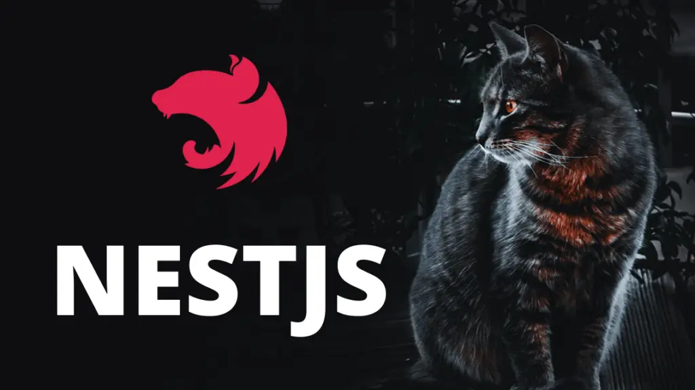

# Welcome to The Series of NestJS Tutorial from Scratch


## Install the NestJS CLI globally using npm
```
npm install -g @nestjs/cli
```

## Use the NestJS CLI to create a new project
```
nest new my-nest-project
```

## Generate a module and service for managing a simple entity (e.g., Task)
```
nest generate module tasks
nest generate service tasks
nest generate controller tasks
```

## Run the server in Development mode
```
npm run start:dev
```

## Install the required packages for MongoDB and NestJS
```
npm i @nestjs/mongoose mongoose
```

## Browse
http://localhost:3000

## Project Structure
```
src/
|-- app.controller.ts          // Main application controller
|-- app.module.ts              // Main application module
|-- app.service.ts             // Main application service
|-- main.ts                    // Entry point for the application

|-- tasks/                     // Feature module for tasks
|   |-- task.model.ts          // Mongoose schema for Task entity
|   |-- tasks.controller.ts    // Controller handling HTTP requests related to tasks
|   |-- tasks.module.ts        // Module encapsulating tasks-related components
|   |-- tasks.service.ts       // Service containing business logic for tasks

|-- middlewares/               // Custom middleware functions (optional)
|   |-- logger.middleware.ts   // Logger middleware example
|   |-- ...

|-- guards/                    // Custom guards for authorization (optional)
|   |-- auth.guard.ts          // Authentication guard example
|   |-- ...

|-- interceptors/              // Custom interceptors (optional)
|   |-- logging.interceptor.ts // Logging interceptor example
|   |-- ...

|-- decorators/                // Custom decorators (optional)
|   |-- roles.decorator.ts     // Custom decorator for handling user roles (example)
|   |-- ...

|-- pipes/                     // Custom pipes for data transformation/validation (optional)
|   |-- validation.pipe.ts     // Validation pipe example
|   |-- ...

|-- config/                    // Configuration files (optional)
|   |-- database.config.ts     // Database configuration example
|   |-- ...

|-- test/                      // Unit and integration tests (optional)
|   |-- tasks.controller.spec.ts // Test file for tasks controller
|   |-- tasks.service.spec.ts    // Test file for tasks service
|   |-- ...

|-- nest-cli.json           // Configuration file for the NestJS CLI
|-- tsconfig.build.json     // TypeScript configuration file specifically used for building the project
|-- tsconfig.json           // TypeScript configuration file for project
```

# Create Service Registry

## Create a new NestJS project
```
nest new service-registry
cd service-registry
```

## Install Required Packages
```
npm install --save @nestjs/microservices @nestjs/config class-validator class-transformer moment
```

##  Create a ServiceRegistryModule
```
nest generate module service-registry
nest generate service service-registry
nest generate controller service-registry